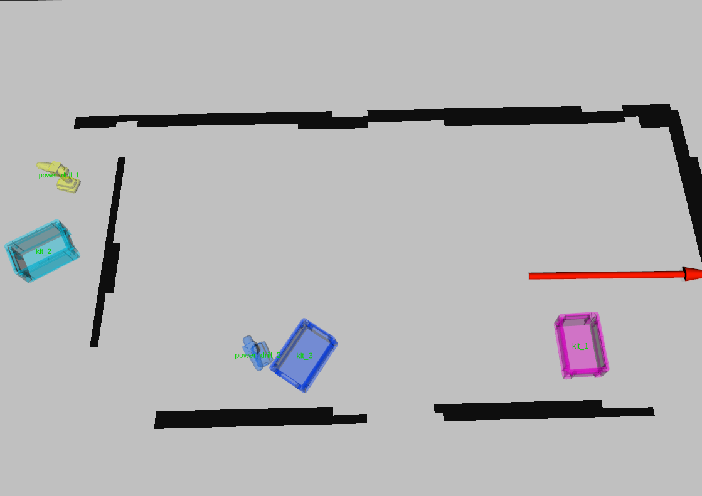

<div align="center">
  <a href="https://www.dfki.de/en/web/research/projects-and-publications/projects-overview/project/copda">
    
  </a>
  <a href="https://www.dfki.de">
    
  </a>
</div>

CoPDA: Comprehensive Perception and Dynamic Anchoring
=====================================================

[](https://gist.github.com/cheerfulstoic/d107229326a01ff0f333a1d3476e068d)

The
[CoPDA](https://www.dfki.de/en/web/research/projects-and-publications/projects-overview/project/copda)
Dynamic Anchoring Agent (DAA) is a set of ROS packages that perform *object
anchoring*, i.e., assign long-term unique instance IDs to objects from object
perception.


Package overview
----------------

The DAA consists of the following ROS packages.

### Core packages

* `daa_anchor_management_ros`: Responsible for anchor spawning and updating.
  The intersection between the tracker and the knowledge base.
* `daa_knowledge_base_ros`: Manages the knowledge base, and provides query and
  update services for other modules to access and modify the knowledge base.
* `daa_tracker_ros`: Implementation of the multiple hypothesis tracking (MHT)
  algorithm \[1\], and greatly inspired by [wire](https://github.com/tue-robotics/wire).

### Subscribed topics

:construction: **TODO**

* daa_tracker/image_rect_color: sensor_msgs/Image
* daa_tracker/camera_info: sensor_msgs/CameraInfo
* daa_tracker/detected_objects: vision_msgs/Detection3DArray
* daa_tracker/color_classification(optional)

### Published topics

:construction: **TODO**

* daa_tracker/tracks: daa_tracker_ros/TrackArray
* object_list: object_pose_msgs/ObjectList (need to install separately)
* anchored_objects: daa_msgs/AnchoredObjectArray
* anchored_object_markers: visualization_msgs/MarkerArray

### Services

:construction: **TODO**

* daa_knowledge_base/query: daa_knowledge_base_ros/QueryRequest

### Helper packages

* `daa_bringup`: Top-level launch and configuration files
* `daa_color_classification`: Classification of the color of the contents of boxes
* `daa_msgs`: ROS message definitions
* `daa_tools`: Tools for visualizing the anchored objects

Installation
------------

First, [install ROS](http://wiki.ros.org/ROS/Installation). Then:

```bash
# create a catkin workspace and clone all required ROS packages
mkdir -p ~/catkin_ws/src
cd ~/catkin_ws/src/
git clone -b noetic git@git.ni.dfki.de:copda/copda.git

copda/install-deps.sh
copda/build.sh
```

You should add the following line to the end of your `~/.bashrc`, and then
close and reopen all terminals:

```bash
source ~/catkin_ws/devel/setup.bash
```


Example usage
-------------

:construction: **TODO**

### Run DAA on the Mobipick real robot

```bash
roslaunch daa_bringup bringup.launch
```

### Run DAA with a rosbag recorded with [Mobipick_labs](https://github.com/DFKI-NI/mobipick_labs) simulation

Download [table_sim_dope_reduced.bag](https://dfkide-my.sharepoint.com/:u:/g/personal/zoyi01_dfki_de/EW6jJXyefLtPjhOSzOju0iUBB8ccjyESh4ki0NSjU6M33g?e=2GzAUi)
and put it under `daa_bringup/rosbag`

Make sure that the previous launch has been terminated. Otherwise, errors will
be raised due to the backward jump in time.

```bash
roslaunch daa_bringup bag_demo.launch
cd copda
rosbag play daa_bringup/rosbag/table_sim_dope_reduced.bag
```

<!-- Anchored objects are being updated  -->

<!--  -->

You can query the DAA knowledge base as follows:

```bash
rosservice call /mobipick/daa_knowledge_base/query header data

# Headers:
# * GET_ALL_INSTANCES=3
# * PROLOG_QUERY=4
# * GET_INSTANCE_COUNT=5

# TODO: is there way to pretty-print the return?
# Get all instances
rosservice call /mobipick/daa_knowledge_base/query 3 ""
# Query all instances that are on top of some surface
rosservice call /mobipick/daa_knowledge_base/query 4 "is_on_top_of(Object,Surface)"
# Query object counts
rosservice call /mobipick/daa_knowledge_base/query 5 "klt"
```

### How to run DAA with custom setups

:construction: **TODO**

Status
------

This software is still actively developed. The interfaces are not yet stable and subject to change.


pre-commit Formatting Checks
----------------------------

This repo has a [pre-commit](https://pre-commit.com/) check that runs in CI.
You can use this locally and set it up to run automatically before you commit
something. To install, use pip:

```bash
pip3 install --user pre-commit
```

To run over all the files in the repo manually:

```bash
pre-commit run -a
```

To run pre-commit automatically before committing in the local repo, install the git hooks:

```bash
pre-commit install
```

References
----------

<a id="1">\[1\]</a> Kim, Chanho, et al. "Multiple hypothesis tracking revisited."
Proceedings of the IEEE international conference on computer vision. 2015.

Acknowledgments
---------------

The Multiple Hypothesis Tracker uses the ProbLib from the
[wire](https://github.com/tue-robotics/wire) project (with some small own
modifications).

This work is supported by the
[CoPDA project](https://www.dfki.de/en/web/research/projects-and-publications/projects-overview/project/copda)
through a grant of the German Federal Ministry of Education and Research (BMBF) with Grant Number 01IW19003.

License
-------

[BSD 3-Clause License](LICENSE)
