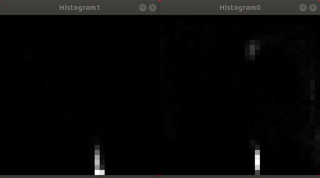

daa_color_classification
========================

This package subscribes to the image stream and the segmentation results.
Object instances' colors are coarsely classified based on the Hue value.

Package overview
----------------

### Subscribed topics

* /mobipick/dope/instance_seg_image
* /mobipick/dope/detected_objects
* /mobipick/eef_main_cam/rgb/image_rect_color

### Published topics

* mobipick/color_classification

### Results

#### List of color names

#### Histograms

#### Instance segmentation images
